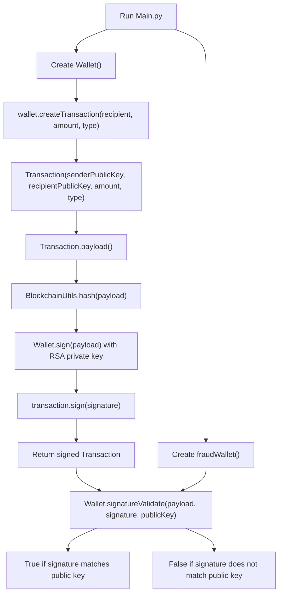
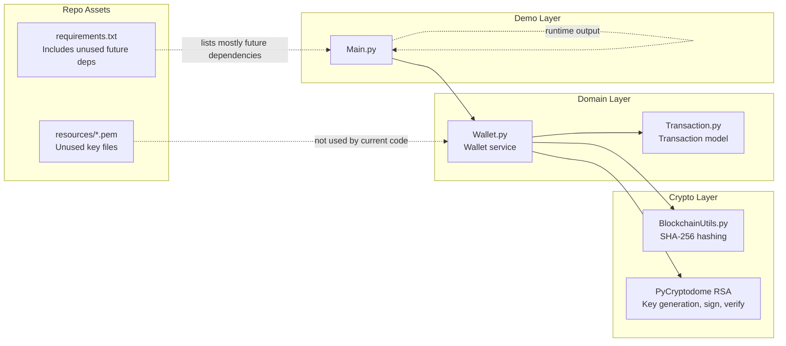

# Proof of Stake POC: Project Flow and Architecture

## Current Scope

Despite the repository name, the current codebase is not yet a full proof-of-stake blockchain.
What it implements today is a local proof of concept for:

- RSA wallet key generation
- Transaction object creation
- Transaction payload hashing
- Transaction signing
- Signature verification

What is not implemented yet:

- Blocks
- Chain state
- Validators or staking logic
- Peer-to-peer networking
- Flask APIs
- Persistent storage

## Source Files

- `Main.py`: entry point and demo flow
- `Wallet.py`: wallet, keypair generation, signing, signature validation
- `Transaction.py`: transaction data model and payload builder
- `BlockchainUtils.py`: deterministic SHA-256 hashing helper
- `resources/*.pem`: key files present in the repo, but not used by the current runtime code

## End-to-End Flow Diagram

## Architectural Diagram

## How the Project Works

### 1. Entry point: `Main.py`

`Main.py` is only a demonstration script.
It creates:

- one real wallet
- one second wallet named `fraudWallet`
- one signed transaction generated by the real wallet

Then it validates the transaction signature using the second wallet's public key.
That means the validation result should be `False`, because the public key does not belong to the signer.

### 2. Transaction creation: `Wallet.createTransaction()`

`Wallet.createTransaction()` does three things:

1. Builds a `Transaction` object using the sender public key, receiver, amount, and type
2. Extracts the transaction payload without the signature
3. Signs that payload with the wallet's RSA private key and stores the signature back on the transaction

This is the core workflow of the project.

### 3. Transaction model: `Transaction.py`

The `Transaction` class stores:

- `senderPublicKey`
- `recipientPublicKey`
- `amount`
- `type`
- `id`
- `timestamp`
- `signature`

The important method is `payload()`.
It creates a copy of the transaction data and clears the `signature` field before hashing/signing.
This is necessary because a signature cannot include itself as part of the signed data.

### 4. Hashing: `BlockchainUtils.hash()`

`BlockchainUtils.hash()` converts input data into deterministic JSON using `json.dumps(..., sort_keys=True)`, encodes it as UTF-8 bytes, and returns a SHA-256 hash object.

The `sort_keys=True` part matters because it ensures the same payload always produces the same hash input format.
Without that, the same logical transaction could hash differently if key ordering changed.

### 5. Signing: `Wallet.sign()`

`Wallet.sign()`:

1. hashes the payload
2. signs the hash with the wallet's private RSA key using `pkcs1_15`
3. returns the signature as a hex string

This proves the transaction came from the private key holder.

### 6. Validation: `Wallet.signatureValidate()`

`signatureValidate()`:

1. converts the hex signature back to bytes
2. imports the provided public key
3. re-hashes the same payload
4. verifies the signature with the public key

If the signature and public key belong together, verification returns `True`.
Otherwise it returns `False`.

## Runtime Sequence

The actual runtime sequence is:

1. Generate wallet A keypair
2. Generate wallet B keypair
3. Create transaction signed by wallet A
4. Rebuild payload from that transaction
5. Validate the signature with wallet B's public key
6. Receive `False`

If validation were performed with wallet A's public key instead, the result would be `True`.

## Important Observations

### 1. The code is a cryptographic transaction demo, not a blockchain yet

There are no:

- blocks
- mempool
- balances ledger
- stake selection
- validator election
- consensus rounds

So the repository is currently best described as a transaction-signing foundation for a future blockchain implementation.

### 2. `resources/*.pem` are not part of the live flow

The repository contains PEM files for genesis and staker keys, but none of the Python modules load or use them.
All runtime keys are generated in memory by `Wallet.__init__()`.

### 3. Several dependencies are not used yet

The current runtime path uses cryptographic support plus the console/debug libraries imported in `Main.py`.
Packages such as Flask, Flask-Classful, requests, p2pnetwork, jsonpickle, and json5 are not referenced by the active source files.
Also, `Main.py` imports `rich` and `devtools`, but they are not listed in `requirements.txt`.

### 4. The comment in `Main.py` is misleading

The line that prints the validation result says it "Should print True if the signature is valid".
In the current code it validates using `fraudWallet.publicKeyString()`, so the expected result is `False`.

## Verified Behavior

Using the project virtual environment:

- validation with a different wallet public key returns `False`
- validation with the original signer public key returns `True`

That confirms the signing and verification pipeline is working as intended.
